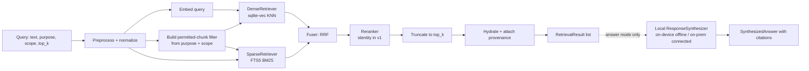

# ModusQ — RAG Retrieval Subsystem Specification

**Audience:** Claude Code (implementation)
**Scope:** The **retrieval** half of the RAG system only. Ingestion, generation, Field Sync, graph retrieval, and reranking models are **out of scope** and are defined here only as contracts at the boundary.
**Status:** Implementation-ready specification.

---

## 1. Purpose and context

ModusQ's RAG is split into two subsystems: an **upstream ingestion pipeline** that produces a license-tagged index, and an **everywhere/offline retrieval engine** that consumes it. The embedding model and the index are the shared handoff between them.

This document specifies the **retrieval engine**. Given a fully-built index (an SQLite database) and a query, it returns ranked, provenance-bearing chunks. It is called by three consumers (all out of scope here): the in-field reference surfacing, the creation-side authoring aid, and — for grounding only — the generation layer. The retrieval engine never generates text and never makes a pass/fail decision; it returns evidence.

### In scope

- Query-time embedding, hybrid (dense + sparse) candidate generation, fusion, license/scope filtering, result assembly with provenance.
- An optional **local response-synthesis** stage for in-field Q&A: when a field tech asks a free-form question whose answer must be *synthesized* rather than read off one clause, the engine can generate that answer **locally** from the retrieved grounding (§5.10). This is the *answer* path — sharply distinct from content generation (below), and the reason it lives here is that it runs as part of answering the query. The synthesizer is a pluggable seam; the on-device model behind it is deferred (§14).
- Two ports with **identical functionality**: Python (Linux only, prototyping) and C++ (cross-platform, ships with ModusQ).
- A modular pipeline that can later accept a graph-based retriever without a rewrite.

### Out of scope (defined as contracts only)

- **Ingestion**: chunking, build-time embedding, index/FTS construction, license tagging, reference-bundle construction. See §8 for what retrieval **requires** ingestion to produce.
- **Content generation** — the creation-side generation that *produces content the retrieval component later consumes*: SOP-to-method conversion, method/Commons authoring, model-assisted verification. It runs upstream, behind point 10's generation backend (cloud / BYO / bundled-local). This is **not** the in-field answer synthesis listed under "In scope": content generation feeds *into* the index (generation → ingestion → retrieval), whereas response synthesis consumes *from* retrieval to answer a live question (retrieval → synthesis → answer). See §5.10 for the full distinction. Only content generation is out of scope.
- **Field Sync / slice distribution.** Retrieval reads whatever SQLite database it is handed (a scoped slice on a device, or the full corpus on a creation node) — identical code path.
- **Graph retrieval** and **reranking** — interfaces only (see §7).

---

## 2. Hard requirements

These are non-negotiable and constrain every decision below.

| # | Requirement |
|---|-------------|
| R1 | **Two ports, identical functionality.** A Python implementation (Linux-only) for rapid prototyping, and a C++ implementation (cross-platform: Linux, Windows, macOS, Android) that ships with ModusQ. Given the same database, model artifacts, and query, both ports MUST return identical ranked results (see §9 for the exact tolerance contract). |
| R2 | **Ingestion is assumed to exist** and is not implemented here. Every requirement retrieval places on ingestion MUST be stated explicitly (§8). If optimal offline behavior needs ingestion to precompute or store something, retrieval is permitted to require it. |
| R3 | **Storage is SQLite.** All persistent index data (chunks, vectors, full-text index, metadata, reference bundles) lives in a single SQLite database file. No other persistent store. |
| R4 | **Public inference models are acceptable**, provided the model can be invoked **identically from both C++ and Python**. This forces a shared inference runtime and tokenizer (see §4). |
| R5 | **Modular pipeline.** Candidate generators, fusion, filtering, and reranking are independent, swappable stages behind interfaces. Adding a graph-based retriever later MUST be a new class plus configuration, not a core rewrite. |
| R6 (derived) | **Fully offline at query time.** Zero network access during `open()` or `search()`. The embedding model, tokenizer, and database are all local files. |
| R7 (derived) | **CPU-only, low footprint.** The C++ port must run on resource-constrained, intrinsically-safe Android devices: no GPU assumption, small model, bounded memory, sub-second query latency on a modest CPU over a scoped slice. |

---

## 3. Architecture overview

Retrieval is a fixed sequence of swappable stages. The query text and (for dense) the query embedding flow into one or more **candidate generators**; their ranked lists are **fused**, optionally **reranked**, truncated to `top_k`, then **hydrated** into full results with provenance. A single **permitted-chunk filter** (derived from the query's purpose and scope) is applied **inside** every candidate generator, so `top_k` is always correct.



### Why this guarantees R1 (identical functionality)

The two ports do **not** reimplement the hard parts. The heavy, divergence-prone work is delegated to **the same native engines** in both languages; only the thin orchestration logic (fusion, filter construction, result assembly) is written twice, and that logic is fully pinned by this spec.

| Concern | Shared native engine | Python access | C++ access |
|---|---|---|---|
| Relational store, BM25 | **SQLite + FTS5** (one engine) | `sqlite3` stdlib + loaded extensions | SQLite C API |
| Dense vector KNN | **sqlite-vec** (SQLite extension, C) | loadable extension | loadable extension / linked |
| Embedding inference | **ONNX Runtime** | `onnxruntime` | ONNX Runtime C++ API |
| Tokenization | **HuggingFace `tokenizers`** (Rust core) | `tokenizers` package | `tokenizers-cpp` |

Because BM25 (FTS5) and vector KNN (sqlite-vec) are literally the same compiled code in both ports, those results are identical by construction. Embedding is identical up to a small floating-point tolerance (§9). The only hand-written logic — RRF and filtering — is deterministic and tie-broken explicitly.

> An alternative architecture is a single C++ core with Python bindings. We are **not** doing that: R1 asks for a real Python implementation for prototyping. Two ports + shared engines is the chosen approach. (A future consolidation to a shared core is noted in §15.)

---

## 4. Technology choices

All choices below are selected specifically to satisfy R1, R3, R4, and R6.

- **SQLite** (R3) — the single index file. Use a recent SQLite with FTS5 compiled in.
- **FTS5** — sparse/keyword retrieval with **BM25** ranking (`bm25()`). Built into SQLite, so identical scoring in both ports.
- **sqlite-vec** — dense vector KNN as a SQLite extension; vectors stored in-DB (R3), exact KNN (appropriate for scoped slices; see §6.2). Same extension in both ports.
- **ONNX Runtime** (R4) — embedding inference. CPU execution provider only (R7).
- **HuggingFace tokenizers** (R4) — `tokenizer.json` loaded by `tokenizers` (Python) and `tokenizers-cpp` (C++); identical tokenization from the same file.
- **Embedding model — configurable, with a recommended default.** Default: **`gte-small`** (384-dim, symmetric — mean pooling, no prefix), which pairs retrieval quality with config simplicity; alternatives include **`bge-small-en-v1.5`** (384-dim, CLS pooling + a query prefix) or **`all-MiniLM-L6-v2`**. The backend is **swappable** via the `Embedder` interface — local ONNX (the default) or a hosted API (OpenAI / Voyage / Gemini), selected by `EmbeddingSettings.provider`. The **only** hard rule is that retrieval's embedding pipeline (provider + model + prefixes + pooling + normalization) is **byte-for-byte the pipeline ingestion used**, as recorded in the index (§8.3) and enforced by the fingerprint.

> If the chosen model is asymmetric (BGE/E5 family), it uses different prefixes for queries vs. passages. Ingestion embeds passages with the passage prefix; retrieval embeds queries with the **query** prefix. Both prefixes are recorded in `index_meta` and MUST be honored.

---

## 5. The retrieval pipeline (stage by stage)

### 5.1 Query model

```text
Query {
  text:        string            # the user/tech/author query
  purpose:     Purpose           # EXECUTION | AUTHORING | GENERATION_GROUNDING
  scope:       MethodRef[] | ALL # restrict to chunks reachable from these methods, or whole index
  top_k:       int               # final result count (default 8)
  dense_k:     int               # dense candidate pool (default 50)
  sparse_k:    int               # sparse candidate pool (default 50)
  synthesize:  bool              # default false. If true, answer() runs §5.10 local response
                                 # synthesis and returns a SynthesizedAnswer. When true, the
                                 # license filter is forced to GENERATION_GROUNDING semantics
                                 # (chunks are fed to a model), regardless of `purpose`.
}

MethodRef { method_id: string, method_version: string }   # version optional; if omitted, latest in DB
```

### 5.2 Preprocess

Normalize the query text deterministically: Unicode NFC, trim, collapse internal whitespace. **Do not** lowercase before embedding (the tokenizer handles casing); FTS lowercasing is the tokenizer's job. Normalization MUST be identical across ports — specify the exact steps and unit-test them.

### 5.3 Embed the query

The embedding pipeline is fixed and MUST match `index_meta`:

1. Prepend `query_prefix` (from `index_meta`; empty for symmetric models).
2. Tokenize with the bundled `tokenizer.json` (`tokenizers` / `tokenizers-cpp`). Use `max_length` and truncation from `index_meta` (default `max_length=512`, truncate=true).
3. Run the ONNX model on CPU. Inputs: `input_ids`, `attention_mask` (+ `token_type_ids` if the model expects it, zero-filled).
4. **Pool** per `index_meta.pooling` (default **mean pooling with attention mask**; alternatives: `cls`).
5. **Normalize** per `index_meta.normalize` (default **L2**). With L2-normalized vectors, cosine similarity equals dot product; the dense store uses this.

Output: `float32[embedding_dim]`. The `Embedder` exposes `config_fingerprint()`; `open()` MUST verify it equals the fingerprint recorded in `index_meta` and **refuse to open on mismatch** (§8.3, §10).

### 5.4 Candidate generators (Retrievers)

Each implements the `Retriever` interface (§7) and returns a **ranked** candidate list. Both built-in retrievers apply the **permitted-chunk filter** (§5.6) as a **pre-filter**, so their top-N are already license- and scope-legal.

- **DenseRetriever** — embeds the query (§5.3), runs sqlite-vec KNN constrained to permitted chunks, returns top `dense_k` as `(chunk_id, rank, raw_score=distance)`.
- **SparseRetriever** — runs an FTS5 MATCH over the query terms constrained to permitted chunks, ranks by `bm25()`, returns top `sparse_k` as `(chunk_id, rank, raw_score=bm25)`.

Pre-filtering correctness: the permitted set MUST be applied **within** the KNN/BM25 query (via sqlite-vec metadata/partition columns or a constrained `chunk_id` subquery, and an FTS join/predicate), **not** as a post-filter on the top-N. If exact in-query filtering for KNN is impractical, over-fetch (`k' = dense_k × overfetch_factor`, default 4) and re-query with a larger `k'` until at least `dense_k` permitted candidates are found or the index is exhausted; document this fallback and its bound.

### 5.5 Fusion

Default fuser: **Reciprocal Rank Fusion (RRF)**, deterministic and score-normalization-free.

```text
fused_score(c) = Σ over retrievers r:  weight[r] / (rrf_k + rank_r(c))
```

- `rrf_k` default **60**. `weight[r]` default **1.0** for all retrievers (configurable).
- `rank_r(c)` is 1-based; a chunk absent from retriever `r`'s list contributes 0 from `r`.
- **Tie-breaking (mandatory for R1):** sort by `fused_score` descending, then by `chunk_id` ascending. Both ports MUST use this exact ordering so identical inputs yield byte-identical orderings.

The `Fuser` is an interface (§7); RRF is the v1 implementation. Weighted-score fusion or a learned fuser may be added later without touching retrievers.

### 5.6 License + scope filtering

This is where the point-2 license model is enforced at query time. The filter is **purpose-driven** and applied as a pre-filter (§5.4).

**Purpose → permitted license classes (default `LicensePolicy`):**

| Purpose | Permitted `license_class` | Extra predicate |
|---|---|---|
| `EXECUTION` | `customer_licensed`, `public_domain`, `modusq_authored`, `third_party_licensed` | — |
| `AUTHORING` | `customer_licensed`, `public_domain`, `modusq_authored`, `third_party_licensed` | — (shippability is enforced at publication, not retrieval) |
| `GENERATION_GROUNDING` | same as above | **AND `ai_grounding_allowed = 1`** |

All purposes additionally require `available = 1` (excludes withdrawn/expired content — e.g. a lapsed class-5 envelope). `third_party_copyrighted` is **never** permitted by any purpose (it should not appear in a synced slice at all; this is a safety net).

**Scope predicate:** if `scope != ALL`, restrict to `chunk_id ∈ (SELECT chunk_id FROM method_chunks WHERE (method_id, method_version) ∈ scope)`. If a `MethodRef` omits `method_version`, resolve to the latest version present in the DB.

`LicensePolicy` is an interface so deployments can tune it, but the table above ships as the default. The policy returns a SQL predicate fragment; both ports build it identically from the same policy definition.

### 5.7 Reranking

A `Reranker` interface exists for a future cross-encoder. **v1 ships the identity reranker** (returns input unchanged). Do not implement a model-based reranker now; just leave the seam.

### 5.8 Result assembly

Truncate fused (and reranked) results to `top_k`, then hydrate each `chunk_id` into:

```text
RetrievalResult {
  chunk_id:        string
  text:            string          # canonical chunk text
  score:           float           # fused score
  component_scores: map<string,float>   # e.g. {"dense": -0.13, "sparse": 7.92}
  document_id:     string
  source_kind:     string          # 'standard' | 'sop' | 'method' | ...
  standard_id:     string | null   # e.g. 'API 653'
  locator:         string | null   # e.g. '§6.4.2' or 'step 7'  (citable)
  license_class:   string
  methods:         MethodRef[]      # methods whose bundle includes this chunk (provenance)
}
```

Provenance is mandatory: every result must be citable back to its source and locator, and must expose its license class (so callers — e.g. a generation grounder — can make a final decision and so the UI can show a source affordance).

### 5.9 Public API

```text
RetrievalEngine.open(db_path: string, model_dir: string, config: EngineConfig) -> RetrievalEngine
    # opens SQLite, loads sqlite-vec, loads ONNX model + tokenizer from model_dir,
    # validates embedding config_fingerprint == index_meta (refuses on mismatch),
    # validates schema_version. No network.

RetrievalEngine.search(query: Query) -> RetrievalResult[]      # retrieve mode (grounding only)
RetrievalEngine.answer(query: Query) -> SynthesizedAnswer      # answer mode: search() + §5.10 local synthesis
RetrievalEngine.close()

SynthesizedAnswer {
  text:      string             # the locally-synthesized answer (advisory; never a verdict)
  citations: RetrievalResult[]  # the grounding the answer was synthesized from
}
```

`open()` is the only place compatibility is validated; `search()` and `answer()` are hot-path and assume a validated engine. `answer()` is exactly `search()` (with the license filter forced to `GENERATION_GROUNDING`) followed by the local `ResponseSynthesizer` (§5.10); with the default `ExtractiveSynthesizer` it needs no generation model. The engine is **read-only** with respect to the index.

### 5.10 Local response synthesis for in-field Q&A (the answer path)

A field tech's question has two modes, and the engine serves both:

- **Retrieve mode** (`search`, default) — return the ranked grounding chunks. When the answer *is* a specific clause, this is the whole job: surface it (`EXECUTION` purpose), the tech reads it, **no model runs**.
- **Answer mode** (`answer`, `synthesize = true`) — when the answer must be *synthesized* across several chunks rather than read off one, the engine retrieves the grounding (forced to `GENERATION_GROUNDING` licensing, because the chunks are fed to a model) and then runs a **local response synthesizer** to generate the answer, with citations back to the grounding.

**This is response generation, and it is deliberately not content generation.** The distinction is directional, and it is the reason this stage belongs in the retrieval subsystem rather than behind the generation backend:

| | Content generation (out of scope, §14) | Response synthesis (this stage, in scope) |
|---|---|---|
| Produces | durable methods / content | an ephemeral answer to a live question |
| Direction | generation → ingestion → **into** the index | retrieval → synthesis → answer **out** to the tech |
| Consumed by | the retrieval component (indexed, later retrieved) | the field tech, immediately; nothing is written to the index |
| Runs | upstream, behind point 10's backend (cloud / BYO / bundled-local) | **locally**, as part of answering the query |

Because the field is offline-first, response synthesis **must be able to run locally** — on the device when there is no connectivity, on the on-prem node when connected. It is **never** a call out to a content-generation service. Composing retrieval and synthesis into one local operation is precisely what "synthesis as part of the retrieval question" means.

**Pipeline placement and contract.** Answer mode is `search` (retrieve + fuse + filter + hydrate, exactly as specified) followed by one stage: `ResponseSynthesizer.synthesize(question, grounding) -> SynthesizedAnswer` (§7). The synthesizer:

- consumes **only** the already-filtered `RetrievalResult[]` grounding — it never re-queries and never reaches outside the permitted, AI-groundable set, so the license guarantees of §5.6 hold unchanged;
- returns the answer text **plus** the `RetrievalResult[]` it used, as citations, so every synthesized answer is traceable to its sources (consistent with the provenance rule, and with point 1's advisory posture — the answer is advisory, never a verdict);
- runs entirely locally and offline.

**What this spec implements vs. defers.** In scope here: the `answer()` entry point, the `ResponseSynthesizer` seam, the local-execution and citation contracts, and a default **`ExtractiveSynthesizer`** (no model — returns the top grounding spans, so answer mode is functional with zero LLM). The **`LocalModelSynthesizer`** — the small on-device generation model that produces fluent synthesized prose — is the real implementation behind the seam; it is pluggable and **deferred / build-to-demand** (§14, §15), mirroring how the reranker model is left as a seam. The model choice and its runtime are a generation concern, not a retrieval one; the retrieval subsystem owns only the seam and the guarantee that synthesis stays local and grounded.

---

## 6. Behavioral details and defaults

### 6.1 Defaults summary

| Param | Default |
|---|---|
| `top_k` | 8 |
| `dense_k`, `sparse_k` | 50 |
| `rrf_k` | 60 |
| retriever weights | 1.0 each |
| `max_length` (tokenizer) | 512 (from `index_meta`) |
| pooling / normalize | mean+mask / L2 (from `index_meta`) |
| overfetch_factor | 4 |

All defaults are overridable via `EngineConfig`/`Query`. The **embedding** parameters are **read from `index_meta`, not config** (they must match the index).

### 6.2 Why exact KNN (not ANN)

The on-device case queries a **scoped slice** (the reference bundles for assigned methods), which is small; exact KNN via sqlite-vec is fast and has no recall loss. ANN (e.g. HNSW) is a **future optimization** for whole-corpus retrieval on a roomy creation node and is explicitly out of scope; the `Store`/`DenseRetriever` interface (§7) is the seam for it.

### 6.3 Thread-safety

`search()` must be safe to call concurrently on a single opened engine (read-only over SQLite). Document the SQLite connection/threading model used (e.g. per-thread connections or a serialized connection). ONNX Runtime sessions are thread-safe for `Run`; share one session.

---

## 7. Module and interface design (R5)

Define these interfaces in both ports (Python: `abc.ABC`/`Protocol`; C++: pure-virtual abstract classes). The engine orchestrates them; it depends only on the interfaces.

```text
interface Embedder:
    embed_query(text: string) -> float32[dim]
    dim() -> int
    config_fingerprint() -> string        # compared against index_meta at open()

interface Retriever:                       # candidate generator
    name() -> string                       # "dense", "sparse", future "graph"
    retrieve(ctx: QueryContext) -> Candidate[]   # ranked; Candidate{chunk_id, rank, raw_score}

interface Fuser:
    fuse(lists: Candidate[][], weights: map<string,float>) -> Scored[]   # Scored{chunk_id, fused_score}

interface Reranker:
    rerank(ctx: QueryContext, scored: Scored[]) -> Scored[]   # v1: identity

interface ResponseSynthesizer:                # §5.10 answer path; runs LOCALLY only
    synthesize(question: string, grounding: RetrievalResult[]) -> SynthesizedAnswer
    # default impl: ExtractiveSynthesizer (no model). Real impl: LocalModelSynthesizer
    # (small on-device generation model) — pluggable, deferred (§14). Never re-queries;
    # never reaches outside the supplied (already permitted, AI-groundable) grounding.

interface LicensePolicy:
    permitted_predicate(purpose: Purpose) -> SqlPredicate     # license-class set + ai_grounding + available

interface Store:                           # all SQLite access lives here
    index_meta() -> map<string,string>
    permitted_chunk_filter(purpose, scope) -> SqlPredicate     # combines license + scope
    dense_knn(query_vec, k, filter: SqlPredicate) -> Candidate[]
    sparse_bm25(query_text, k, filter: SqlPredicate) -> Candidate[]
    hydrate(chunk_ids: string[]) -> ChunkRecord[]              # text + provenance + license_class + methods
```

`QueryContext` is the per-query bundle the engine builds and passes to retrievers/reranker: `{ raw_text, normalized_text, query_vector, purpose, scope, permitted_filter, top_k, dense_k, sparse_k }`.

**Adding graph retrieval later** (illustrative, to validate R5): implement `class GraphRetriever : Retriever` (it may read graph tables that an **ingestion extension** populates — out of scope here), then add `"graph"` to the configured retriever list with a weight. The engine, fuser, filter, and result assembly are unchanged. No core rewrite.

**Configuration** (`EngineConfig`) is declarative and drives which retrievers run:

```text
EngineConfig {
  retrievers:  [ {name:"dense", weight:1.0, k:50}, {name:"sparse", weight:1.0, k:50} ]
  fuser:       {type:"rrf", rrf_k:60}
  reranker:    {type:"identity"}
  synthesizer: {type:"extractive"}   # answer mode (§5.10). {type:"local_model", ...} when built (§14); always local
  defaults:    {top_k:8, overfetch_factor:4}
}
```

### 7.1 C++ ABI: string and ownership conventions

The C++ port's public interface uses C-style strings at the boundary, so it binds cleanly from .NET (WinUI 3), JNI (Android), and other FFI callers.

- **String inputs** are passed as `const char* str`, where `str` points to a **UTF-8 encoded, NUL-terminated** string. The **caller owns** the string and is responsible for its lifetime and cleanup. The **callee must not assume the string persists after the call returns** — if it needs to retain the contents, it copies them into its own storage during the call. This applies to every string-typed input on the public surface, including the fields of input structs (`Query.text`, `MethodRef.method_id`, `MethodRef.method_version`) and the `open()` paths (`db_path`, `model_dir`).
- **String outputs** (e.g. `RetrievalResult.text`, `RetrievalResult.locator`, `SynthesizedAnswer.text`) are returned as owning `std::string` inside the returned result objects, so ownership is unambiguous and released by RAII when the result goes out of scope. No output string aliases caller-provided memory.
- **Encoding is UTF-8 throughout** on both sides of the boundary; no other encoding crosses the interface.

The Python port mirrors the same logical interface using native `str` (Python owns its strings). This convention governs the C++ surface specifically and does not change cross-port behavior (§9).

---

## 8. The ingestion contract (what retrieval requires)

Ingestion is out of scope, but retrieval depends on the database it produces. The following is the **contract**. Per R2, anything here that ingestion does not already do is a **requirement on ingestion**.

### 8.1 SQLite schema retrieval consumes

```sql
-- Build/compatibility metadata (key/value)
CREATE TABLE index_meta ( key TEXT PRIMARY KEY, value TEXT NOT NULL );
-- REQUIRED keys: schema_version, ingestion_version, built_at,
--   embedding_model_id, embedding_model_revision, embedding_dim,
--   tokenizer_sha256, pooling, normalize, query_prefix, passage_prefix,
--   max_length, fts_tokenizer, embedding_config_fingerprint

CREATE TABLE documents (
  document_id   TEXT PRIMARY KEY,
  title         TEXT,
  source_kind   TEXT NOT NULL,         -- 'standard' | 'sop' | 'method' | ...
  standard_id   TEXT,                  -- e.g. 'API 653'
  doc_version   TEXT,
  license_class TEXT NOT NULL          -- see enum below
);

CREATE TABLE chunks (
  chunk_id             TEXT PRIMARY KEY,
  document_id          TEXT NOT NULL REFERENCES documents(document_id),
  ordinal              INTEGER NOT NULL,
  text                 TEXT NOT NULL,    -- canonical chunk text (returned verbatim to caller)
  locator              TEXT,             -- citable locator, e.g. '§6.4.2' / 'step 7'
  license_class        TEXT NOT NULL,    -- denormalized from documents for fast filtering
  ai_grounding_allowed INTEGER NOT NULL, -- 0/1; class policy AND class-5 envelope grant
  available            INTEGER NOT NULL DEFAULT 1, -- 0 if expired/withdrawn
  content_hash         TEXT NOT NULL     -- ties chunk to method-version provenance
);

-- Resolved reference bundles: which method versions reach which chunks (scope + provenance)
CREATE TABLE method_chunks (
  method_id      TEXT NOT NULL,
  method_version TEXT NOT NULL,
  chunk_id       TEXT NOT NULL REFERENCES chunks(chunk_id),
  PRIMARY KEY (method_id, method_version, chunk_id)
);

-- Dense vectors (sqlite-vec). Include filterable metadata if the version supports it.
CREATE VIRTUAL TABLE vec_chunks USING vec0(
  chunk_id TEXT PRIMARY KEY,
  embedding float[/* embedding_dim */]
);

-- Sparse / BM25
CREATE VIRTUAL TABLE fts_chunks USING fts5(
  chunk_id UNINDEXED,
  text,
  tokenize = '/* must equal index_meta.fts_tokenizer */'
);
```

`license_class` enum (matches the strategy doc): `customer_licensed`, `public_domain`, `modusq_authored`, `third_party_copyrighted`, `third_party_licensed`.

### 8.2 Guarantees ingestion MUST provide

1. **Embedding-pipeline identity is recorded** in `index_meta` (model id+revision, dim, tokenizer SHA-256, pooling, normalize, both prefixes, max_length) and a single `embedding_config_fingerprint` summarizing them. Retrieval validates its own `Embedder.config_fingerprint()` against this and refuses on mismatch.
2. **Vectors are stored normalized** consistently with `index_meta.normalize`, at `embedding_dim`, one per chunk in `vec_chunks`.
3. **FTS index is built over the same canonical `chunks.text`** with the tokenizer named in `index_meta.fts_tokenizer`. Retrieval queries FTS consistently with that tokenizer.
4. **License tags and `ai_grounding_allowed` are populated per chunk**, including the class-5 envelope grant collapsed into the boolean. `available` reflects expiry/withdrawal.
5. **`method_chunks` is populated** with the resolved reference bundles (method version → chunk).
6. **Provenance fields populated** (`document_id`, `source_kind`, `standard_id`, `locator`).
7. **`schema_version`** present and matched by retrieval.
8. Chunking granularity is ingestion's choice (structure-aware); retrieval returns whole chunks verbatim.

### 8.3 Requested for optimal offline behavior (R2 permits requiring these)

- **Denormalized filter columns on chunks** (`license_class`, `ai_grounding_allowed`, `available`) so pre-filtering needs no joins — required for fast on-device KNN pre-filtering.
- **Filterable metadata on `vec_chunks`** (sqlite-vec partition/auxiliary columns for `license_class`, `ai_grounding_allowed`, `available`) if the sqlite-vec version supports it, to enable in-KNN pre-filtering (avoids the over-fetch fallback).
- **Indexes** on `method_chunks(chunk_id)` and `chunks(license_class, available)`.
- The **bundled model artifacts** (`model.onnx`, `tokenizer.json`) that match `index_meta` must be shipped with the client; their identity is verified at `open()`.

---

## 9. Cross-port identical-functionality contract (R1)

**Scope — portability is one-directional and SQLite-only.** The contract is that a SQLite
database *produced by the Python ingestion path* is consumable (read-only) by the C++ port. It
is **not** required that (a) Postgres databases be consumable in C++, nor (b) C++ ever write to
the SQLite database. Postgres is a separate, Python-only retrieval backend with its own ANN; the
bit-identity guarantees below bind only the **Python-SQLite ↔ C++-SQLite** pair.

Define "identical" precisely so it is testable.

| Stage | Identity guarantee | Mechanism |
|---|---|---|
| Sparse / BM25 | **Bit-identical** scores and ranks | Same SQLite + FTS5 engine in both ports |
| Dense KNN | **Bit-identical** for identical query vectors | Same sqlite-vec extension in both ports |
| Query embedding | **Within tolerance**: cosine(py_vec, cpp_vec) ≥ 0.9999, max abs elementwise diff ≤ 1e-4 | Same ONNX model, same tokenizer.json, same pooling/normalize; minor cross-platform float drift permitted |
| Fusion (RRF) | **Identical ordering** | Deterministic formula + mandatory `(score desc, chunk_id asc)` tie-break |
| Final ranked `chunk_id` list | **Identical** for any query where no two fused scores are within the embedding-drift band of each other | Above, combined |

> Because tiny embedding float drift could, in rare near-ties, flip two adjacent results, the contract is: identical query vectors ⇒ identical results (always); and embeddings match within tolerance ⇒ result lists are identical except possibly for adjacent items whose fused scores differ by less than the drift band. The parity harness (below) asserts the strong form on fixed query vectors and the tolerant form on model-embedded queries.

**Parity test harness (required deliverable):**

- A set of **fixture SQLite databases** (small, hand-built or ingestion-produced) committed to the repo, plus a **query set** (varied purposes, scopes, term/semantic mixes, edge cases).
- A runner that executes the query set in **both** ports against the **same** fixtures and diffs: ranked `chunk_id` lists (must match), component scores (dense/BM25 must match exactly; fused must match), and provenance fields.
- A **golden-embedding** test: a fixed set of query strings, embedded in both ports, asserting the tolerance above.
- CI runs the harness on every change to either port.

---

## 10. Error handling and edge cases

- **Embedding fingerprint mismatch** (engine model ≠ `index_meta`): hard error at `open()`. Never silently embed with a mismatched model.
- **`schema_version` mismatch**: hard error at `open()`.
- **Missing `vec_chunks`/`fts_chunks`/required `index_meta` keys**: hard error at `open()` with a clear message naming the missing artifact (this is an ingestion-contract violation).
- **Empty result after filtering** (purpose/scope permits nothing): return an empty list — not an error.
- **Scope references unknown method/version**: resolve what exists; unknown refs contribute no chunks; if all unknown, empty result.
- **Query embeds to all-zeros / empty query text**: return empty result; do not crash.
- **`available = 0` / expired class-5 content**: filtered out by the `available` predicate; never returned.
- **No network**: any attempt to fetch a model/tokenizer/remote resource at runtime is a defect (R6).

---

## 11. Project layout (suggested)

```
retrieval/
  spec/                      # this document
  shared/
    models/                  # bundled model.onnx + tokenizer.json (matched to a fixture index)
    fixtures/                # fixture SQLite DBs + golden outputs
    queries/                 # parity query set (JSON)
  python/                    # Linux-only prototype
    modusq_retrieval/
      engine.py  embedder.py  retrievers.py  fusion.py  policy.py  store.py  types.py
    tests/
  cpp/                       # cross-platform, ships with ModusQ
    include/modusq/retrieval/...
    src/...
    tests/
    CMakeLists.txt           # builds on Linux/Windows/macOS/Android; finds SQLite, sqlite-vec, onnxruntime, tokenizers-cpp
  parity/                    # cross-port harness + CI entrypoint
```

Keep the interface names, config keys, default values, and the RRF/tie-break/filter logic **identical** across `python/` and `cpp/`; they are the contract that makes the ports interchangeable.

---

## 12. Suggested build order (for the implementer)

1. **Python `Store`** over a fixture DB: schema reader, `index_meta` validation, hydrate.
2. **Python `Embedder`** (ONNX + tokenizers): tokenize → run → pool → normalize; `config_fingerprint()`.
3. **SparseRetriever** (FTS5/BM25) and **DenseRetriever** (sqlite-vec) with the permitted-chunk pre-filter.
4. **Fuser** (RRF + tie-break) and **RetrievalEngine.search** end-to-end; `LicensePolicy` default; identity `Reranker`.
5. **Edge cases** (§10), config plumbing, thread-safety.
6. **Parity harness** scaffolding with golden outputs from the Python port.
7. **C++ port**, mirroring interfaces and logic exactly; CMake across the target platforms; pass the parity harness.

---

## 13. Acceptance criteria (definition of done)

- [ ] Both ports build and run **offline** (no network at `open()`, `search()`, or `answer()` — including local response synthesis), CPU-only.
- [ ] C++ port builds on Linux, Windows, macOS, and Android (CMake).
- [ ] `open()` validates embedding fingerprint and `schema_version` and refuses on mismatch.
- [ ] Hybrid dense+sparse retrieval with RRF fusion and the mandatory tie-break.
- [ ] License/scope pre-filtering enforced **inside** both retrievers; `GENERATION_GROUNDING` excludes `ai_grounding_allowed = 0`; `third_party_copyrighted` and `available = 0` never returned.
- [ ] Results carry full provenance (document, locator, license class, method associations) and component + fused scores.
- [ ] Pipeline is interface-driven; a stub `GraphRetriever` can be registered via config and runs through fusion without core changes (a no-op stub demonstrating R5 is sufficient here).
- [ ] Answer mode works end to end with the default `ExtractiveSynthesizer` (no model): `answer()` retrieves under `GENERATION_GROUNDING`, runs the **local** synthesizer, and returns an answer with citations; the `LocalModelSynthesizer` seam is present but may be unimplemented.
- [ ] C++ public surface follows §7.1 (inputs `const char*` UTF-8 NUL-terminated, caller-owned, non-retained; outputs owning `std::string`).
- [ ] Parity harness passes: identical ranked `chunk_id` lists across ports on fixed query vectors; embedding tolerance met; CI wired.
- [ ] All §10 edge cases covered by tests.

---

## 14. Out of scope (explicit)

Ingestion; **content generation and its backend** (SOP-to-method conversion, method/Commons authoring, model-assisted verification, and point 10's cloud / BYO / bundled-local generation backend); Field Sync/slice distribution; graph retrieval implementation; model-based reranking; ANN indexing; embedding-model selection/training/export (a public model is assumed available as ONNX).

The in-field **response synthesizer's model** (`LocalModelSynthesizer`, §5.10) is out of scope **as an implementation** and is deferred / build-to-demand — but, unlike content generation, its *seam, local-execution contract, citation contract, and the `answer()` path are in scope and specified here*, with the no-model `ExtractiveSynthesizer` shipping as the default. All items above are referenced only as contracts or seams.

## 15. Future extensions (seams left open, not built)

- **Graph/ontology retriever** — new `Retriever` impl + ingestion extension (out of scope) + config entry.
- **Cross-encoder reranker** — replace the identity `Reranker`.
- **Local model response synthesizer** — replace the default `ExtractiveSynthesizer` with a small on-device generation model (`LocalModelSynthesizer`, §5.10) for fluent in-field answers; runs locally and offline, behind the existing seam.
- **ANN dense index** — behind `Store.dense_knn` for whole-corpus retrieval on roomy nodes.
- **Shared C++ core with Python bindings** — possible later consolidation if maintaining two ports proves costly; the identical-interface discipline here makes that migration low-risk.
