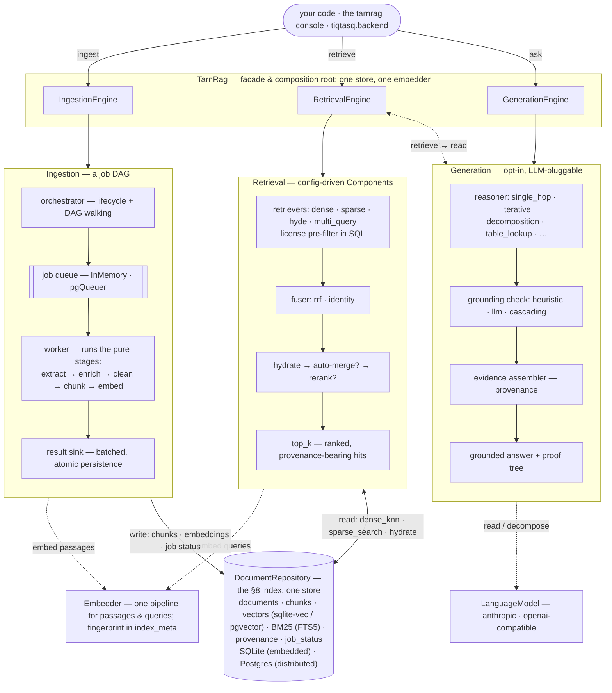

# Architecture overview

tarn.rag is three engines over one store, with a facade wiring them together. This page explains
the shape and the invariants that hold it together; the full design specs live in
[`doc/`](../../doc) and the contributor-oriented deep dive in [`CLAUDE.md`](../../CLAUDE.md).

## The three engines

`TarnRag` is the composition root: it builds the one store (the repository) and the embedder once
and injects both into all three engines — one connection, so retrieval sees ingests live. Each
engine is also usable standalone via its `create()` factory, built from `Settings`.

## One store: the §8 index

Everything lands in a single `DocumentRepository`: documents, chunks, dense vectors, the sparse
(BM25) index, provenance, and ingestion job status. Embedded mode is one SQLite file (sqlite-vec
for KNN, FTS5 for BM25); distributed mode is Postgres (pgvector). All storage goes through
SQLAlchemy 2.0 Core with dialect-specific behavior isolated to hooks, so the two backends stay
behaviorally identical. The SQLite file is deliberately portable — a future C++ reader can open it
directly.

Writes are transactional and idempotent: documents are keyed by a **stable** `source_id`, and
re-ingesting replaces chunks and embeddings rather than duplicating them. Identity (`ID_POLICY`) is
separate from content — every document also stores a `content_hash` for dedup queries.

## One embedder, fingerprinted

The same embedder embeds passages at ingest time and queries at search time — vectors are only
comparable because the pipeline is identical. That identity (provider, model, dimension, prefixes,
header-path injection, …) is recorded as a fingerprint in `index_meta`, and `RetrievalEngine`
refuses to open an index whose fingerprint doesn't match the current settings. A mismatch is a
configuration error caught at startup, never silently-wrong search results.

## Ingestion is a job DAG

The pipeline is a DAG of **pure stages** (no DB or queue access), executed as one job per
`(item, stage)`. Fan-out is natural: a chunker producing *m* chunks enqueues *m* embed jobs, with
in-flight items traveling inline in the job payload. Three roles stay strictly separated:

- the **worker** computes (runs a stage on a batch and reports the results);
- the **result sink** persists;
- the **orchestrator** owns lifecycle — it records status, finalizes the sink, and enqueues
  downstream jobs *only after* upstream results are persisted, so a crash anywhere requeues rather
  than corrupts.

Embedded mode runs this same machinery over an in-process queue (each ingest call completes
synchronously); distributed mode swaps in pgQueuer over Postgres — the queue is a port, not a
different code path. Jobs are internal: the public surface exposes document status, never job
mechanics.

## Everything else is a Component

Extractors, chunkers, enrichers, retrievers, fusers, mergers, rerankers, classifiers, reasoners,
grounding checkers — all are config-driven Components composed by spec under `Settings.components`
(the [catalog](../reference/components.md) lists them). Comparing methods — hybrid vs. dense-only,
single-hop vs. decomposition — is a config edit, not a code change. Generation is an opt-in layer:
retrieval works LLM-free, and license/scope filtering is enforced as a SQL pre-filter inside the
retrievers.

## Where the deep detail lives

| Topic | Spec |
|---|---|
| Ingestion requirements & job model | [`doc/FUNCTIONAL_REQUIREMENTS.md`](../../doc/FUNCTIONAL_REQUIREMENTS.md) |
| Retrieval subsystem (ModusQ) | [`doc/ModusQ_RetrievalSubsystemSpec.md`](../../doc/ModusQ_RetrievalSubsystemSpec.md) · [`doc/retrieval-architecture-design.md`](../../doc/retrieval-architecture-design.md) |
| Generation design | [`doc/generation-architecture-design.md`](../../doc/generation-architecture-design.md) |
| Layout-aware extraction | [`doc/structured-document-design.md`](../../doc/structured-document-design.md) · [`doc/extraction-seam-design.md`](../../doc/extraction-seam-design.md) |
| Measured results & phase history | [`doc/phases.md`](../../doc/phases.md) |
